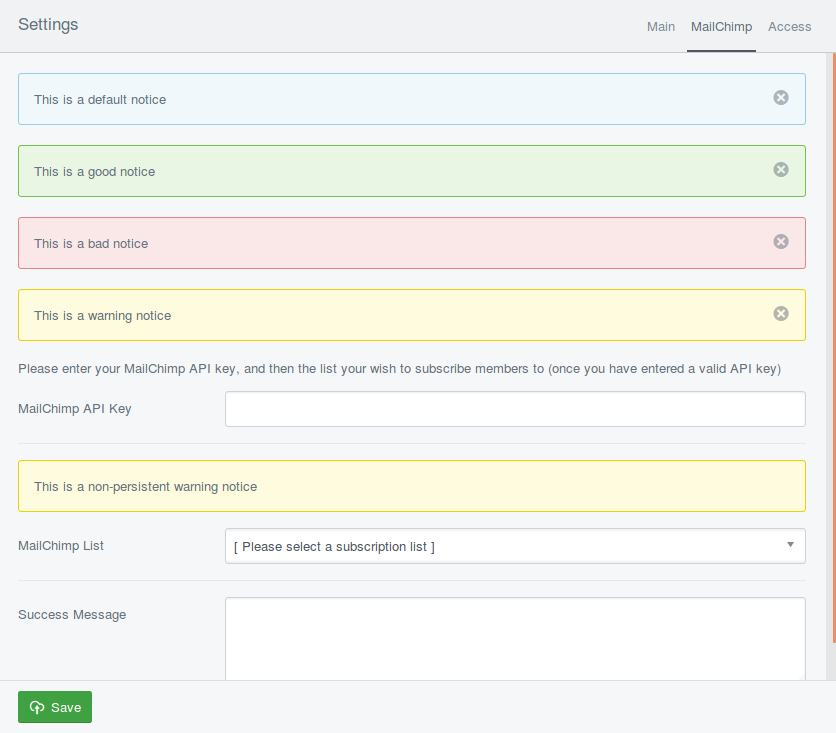

# NoticeField

NoticeField extends LiteralField, so you can add pretty much anything you want to
provided it is encoded with htmlentities() or htmlspecialchars().
This allows you to create a notice in the CMS that can (by default) remain visible on all the tabs.

A persistent `NoticeField` will get displayed directly below the tabs (where an
error message would normally be shown), and includes a "close" button.

If a `NoticeField` is set to **not** be persistent, is it simply shown in the form
where you inserted it.

NoticeFields use inbuilt SilverStripe 4 CSS classes, and defaults to the `notice`
class if none is specified. By default you can choose from:

- good
- bad
- notice
- warning

If you have added your own CSS to the CMS, then you can of course use custom CSS classes.



## Usage

```php
<?php

use Axllent\FormFields\Forms\NoticeField;

class MyPage extends Page
{

    public function getCMSFields()
    {
        $fields = parent::getCMSFields();

        /* Persistent NoticeFields across all tabs */
        $fields->addFieldsToTab('Root.Main', [
            NoticeField::create('Notice1','This is a default notice', 'notice'),
            NoticeField::create('Notice2','This is a good notice', 'good'),
            NoticeField::create('Notice3','This is a bad notice', 'bad'),
            NoticeField::create('Notice4','This is a warning notice', 'warning'),
        ]);

        /* Non-persistent NoticeField (note the 4th parameter `false`) */
        $fields->addFieldToTab(
            'Root.Main',
            NoticeField::create('Notice5','You must enter content', 'warning', false),
            'Content'
        );

        return $fields;
    }
}
```
