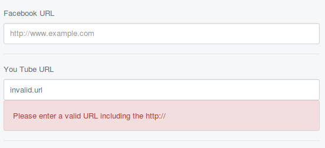

# URLField

URLField provides an easy way to add a validating text input for URLs.
It includes a placeholder with `http://www.exmaple.com` to indicate a full URL is required.



## Usage

```php
<?php

use Axllent\FormFields\URLField;

class MyPage extends Page
{

    public function getCMSFields()
    {
        $fields = parent::getCMSFields();

        $fields->addFieldsToTab('Root.Main', [
            URLField::create('FacebookURL'),
            URLField::create('YouTubeURL')
        ]);

        return $fields;
    }
}
```
